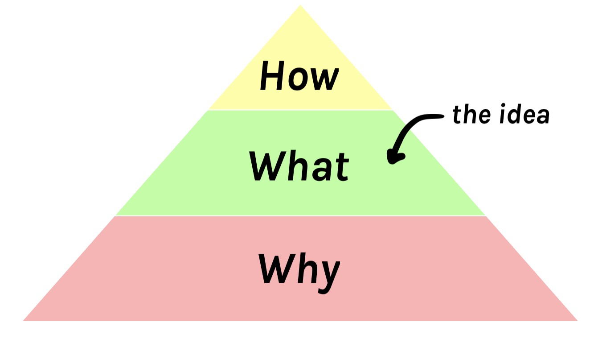
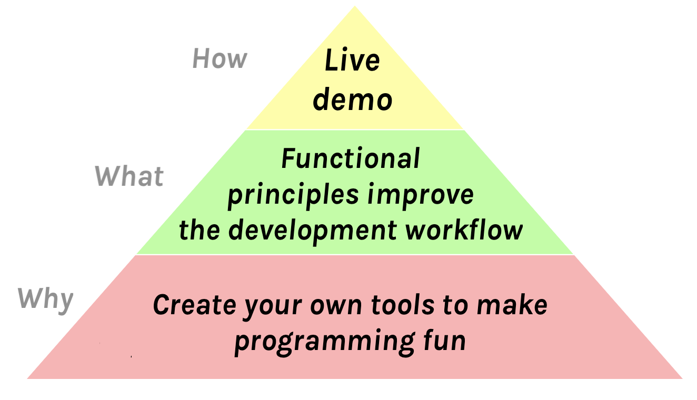
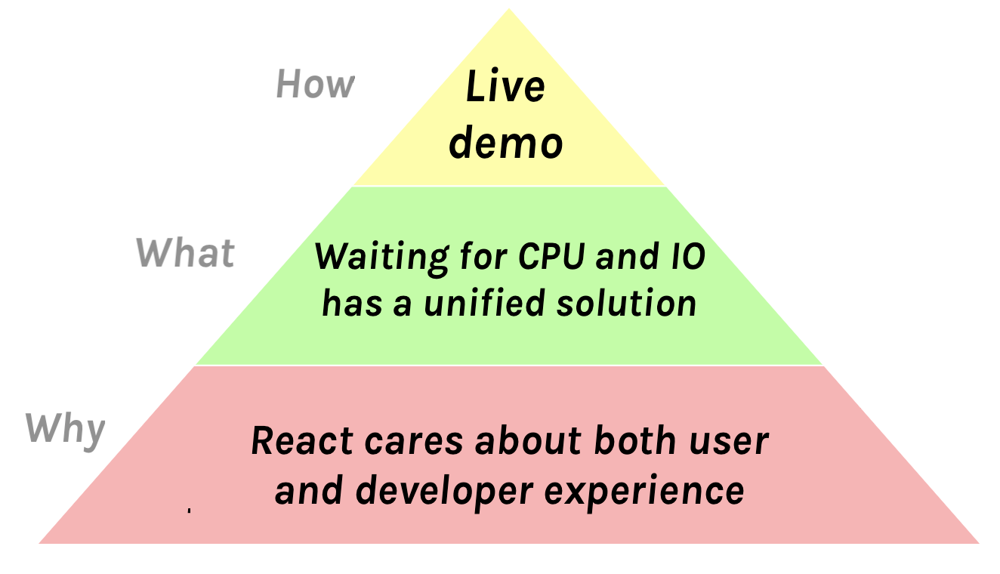

我做过[一些](https://www.youtube.com/watch?v=xsSnOQynTHs) [技术](https://www.youtube.com/watch?v=nLF0n9SACd4) [讲座](https://www.youtube.com/watch?v=dpw9EHDh2bM)，我认为效果还不错。

有时人们会问我如何准备讲座。对于每一位演讲者来说，答案都非常个人化。我只是分享对我有效的方法。

**这是系列文章的第二篇**，我将解释我准备技术讲座的过程——从构思到实际演讲当天：

- **[技术讲座准备（一）：动机](/preparing-for-tech-talk-part-1-motivation/)**
- **技术讲座准备（二）：内容、原因和方法 (_本文_)**
- **[技术讲座准备（三）：内容](/preparing-for-tech-talk-part-3-content/)**
- 待续

---

**在这篇文章中，我将重点介绍如何找到我讲座的内容、原因和方法。** 尽早完成这项工作有助于我在后期避免很多麻烦。

---

如果你还没看过[《盗梦空间》](https://en.wikipedia.org/wiki/Inception)，今天就去看吧。这是一部令人愉悦的大片，拥有令人费解的视觉效果和引人入胜的情节。但正如 [Ryan Florence](https://mobile.twitter.com/ryanflorence) 教我的那样，它也包含了创造令人难忘的讲座的好建议。

这部电影讲述的是在人们睡觉时将想法植入他们大脑的故事。这听起来可能有点侵入性（而且在电影中是违法的）。但是，如果你报名参加技术讲座，这非常准确地描述了你面临的挑战。

---

**你希望人们从你的讲座中记住的一件事是什么？** 我尽量在早期就将其概括为一个句子。这个想法不应该超过十几个字。人们会忘记你所说的大部分内容，所以你需要仔细选择你想要让他们记住的*内容*。这是你想植入他们大脑的种子。

例如，以下是我的讲座的核心思想：

- [热重载](https://www.youtube.com/watch?v=xsSnOQynTHs)： “函数式原则改进了开发工作流程。”

- [超越 React 16](https://www.youtube.com/watch?v=nLF0n9SACd4)： “等待 CPU 和 IO 有一个统一的解决方案。”

- [Introducing Hooks](https://www.youtube.com/watch?v=dpw9EHDh2bM)： “Hooks 使有状态逻辑可重用。”

我并不总是明确地大声*说出*中心思想，或者将其写在幻灯片上，但它始终是我讲座的智力支柱。我说的和展示的一切最终都必须是为了支持这个想法。我想向你证明这一点。

---

一个想法是我讲座的**“内容”**。但还有**“方法”**和**“原因”**：

**“方法”**是我向观众传达想法的方式。就我个人而言，我更喜欢现场演示，但有很多方法都可行。我将在本系列后续的博客文章中更多地讨论“方法”。

我们刚刚讨论了**“内容”**，这是讲座的核心思想。这是我想植入你大脑的想法，也是我希望你从中获得的见解。这是我希望人们与他们的朋友和同事分享的内容。

这就引出了**“原因”**。

---

为了解释**“原因”**，我将引用电影《盗梦空间》中的这段对话：

**(警告：剧透！)**

> **科布：** “我要瓦解我父亲的帝国。” 现在，这显然是罗伯特自己会选择拒绝的想法。这就是为什么我们需要把它深深地植入他的潜意识中。潜意识是由情感驱动的，对吧？而不是理性。我们需要找到一种方法将这个想法转化为情感概念。
>
> **亚瑟：** 你如何将一个商业策略转化为一种情感？
>
> **科布：** 这正是我们来这里要弄清楚的，对吧。现在罗伯特和他父亲的关系至少可以说很紧张。
>
> **伊姆斯：** 那我们能利用这一点吗？我们可以建议他解散他父亲的公司，以此来“气气”那个老家伙。
>
> **科布：** 不，因为我认为积极的情感总是胜过消极的情感。我们都渴望和解，渴望宣泄。我们需要罗伯特·费舍尔对这一切产生积极的情感反应。
>
> **伊姆斯：** 好吧，试试这个？“我父亲接受我想为自己创造，而不是遵循他的脚步。”
>
> **科布：** 这或许可行。

现在，我并不是建议你用你的演讲来瓦解帝国。

但是，你肯定有[理由](/preparing-for-tech-talk-part-1-motivation/)站在成千上万的人面前谈论某件事。你*相信*某件事——并且你想让其他人也分享这种感觉。**这就是“原因”——你讲座的情感核心。**

---

以下是我讲座中“内容”、“原因”和“方法”的示例。

_(上面的金字塔适用于 [具有时间旅行的热重载](https://www.youtube.com/watch?v=xsSnOQynTHs))_

_(上面的金字塔适用于 [超越 React 16](https://www.youtube.com/watch?v=nLF0n9SACd4))_

_(上面的金字塔适用于 [Introducing Hooks](https://www.youtube.com/watch?v=dpw9EHDh2bM))_

一个令人难忘的讲座需要一个简洁的想法，让观众关心它，并有清晰且令人信服的执行。这就是“内容”、“原因”和“方法”。

---

在这篇文章中，我描述了我是如何组织我的讲座的核心思想的。再次强调，我只是分享对我有效的方法——[有很多种讲座](https://mobile.twitter.com/jackiehluo/status/1077717283026411520)，你对此的看法可能大相径庭。

在本系列接下来的文章中，我将讨论准备讲座大纲、幻灯片、排练讲座以及我在演讲当天所做的事情。

**本系列下一篇：[技术讲座准备（三）：内容](/preparing-for-tech-talk-part-3-content/)**。

**本系列上一篇：[技术讲座准备（一）：动机](/preparing-for-tech-talk-part-1-motivation/)**。
